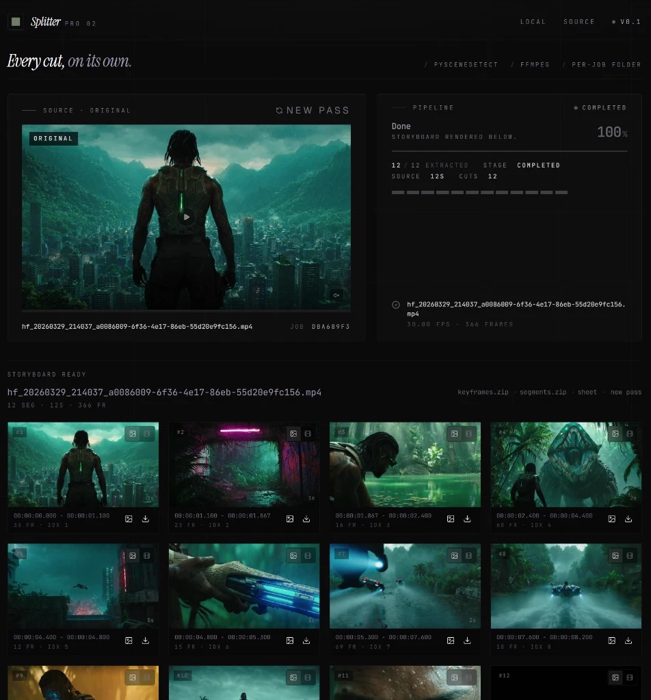
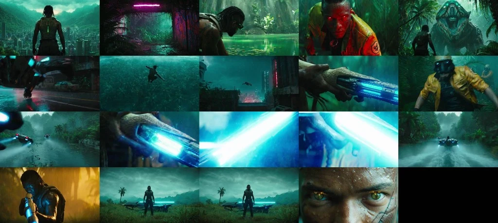

# Splitter Pro 2



**Result — contact sheet (exported `contact-sheet.jpg` / storyboard stills):** one frame per detected scene in a single grid, produced after a job finishes.



Splitter Pro 2 is a local-first video review app that splits a video by detected scene cuts, an exact number of equal slices, or a fixed time step. It renders a storyboard with one stable midpoint image plus a previewable clip for every segment.

The video page offers three sampling modes before upload:

- **Scene cuts** — PySceneDetect finds visual edit points automatically.
- **Equal count** — creates an exact total (for example 10) across the complete video and extracts the midpoint image from every equal slice.
- **Time step** — creates one slice and midpoint image every selected number of seconds, with a shorter final slice when needed.

## Stack

- Backend: FastAPI, PySceneDetect, ffmpeg
- Frontend: React 19, Vite 8, Tailwind CSS v4, shadcn-style primitives
- Tooling: `uv` for Python, `bun` for frontend

## Scene detection (frame-based)

Cuts are detected and stored on **frame indices**; durations in the UI are derived from `fps` and those frames. PySceneDetect `AdaptiveDetector` is the default. Tune without code changes using env vars (prefix `SPLITTER_`, see `backend/src/backend/config.py`):

| Variable | Role |
|----------|------|
| `SPLITTER_ADAPTIVE_THRESHOLD` | Lower → more / finer cuts (more sensitive). |
| `SPLITTER_MIN_SCENE_LEN_FRAMES` | Minimum gap (frames) before another cut can register; lower allows quicker successive shots. |
| `SPLITTER_MIN_CONTENT_VAL` | Lower → easier to pass as a new scene. |
| `SPLITTER_ADAPTIVE_WINDOW_WIDTH` | Smaller → less smoothing, can catch very short shot changes. |
| `SPLITTER_MERGE_SHORT_SCENE_FRAMES` | Only merge runs shorter than this (frames) to drop spurious double-cuts; `0` disables. |

For very dense edits (montages, many short shots), start by **lowering** `SPLITTER_ADAPTIVE_THRESHOLD` a bit and **lowering** `SPLITTER_MIN_SCENE_LEN_FRAMES` before changing merge, so real short shots are not merged away.

**Contact sheet & “same shot” stills (notes for next time).** The grid is one still **per segment** PySceneDetect returns. A cut is **not** the same as “a new eyeball shot in the script”—it is a **content / motion** boundary. A bright flash, a light flicker, or a fast wipe inside what feels like one take can still register as a new scene, so two adjacent keyframes (e.g. 17 and 18) can look **almost identical** even though the detector saw a big frame-to-frame change in the data. Tuning `SPLITTER_*` nudges how often that happens but does not understand “this still looks the same to a human.”

*Future / smarter (not built yet):* e.g. compare adjacent keyframes (perceptual hash, SSIM, or small embedding) and, when a pair looks suspiciously similar, **prompt the user**—something like “These shots may be the same shot. Keep them as separate segments, or treat them as one?”—then merge or split based on that choice, plus optional rules for short spikes (flash) vs. true edit points. For now, treat duplicate-looking tiles as a known quirk of pure statistical scene detection, not a bug in the contact-sheet export itself.

## Local setup

```powershell
uv venv
.\.venv\Scripts\Activate.ps1
cd backend
uv sync --active
cd ..\frontend
bun install
```

## Run in development

Terminal 1:

```powershell
.\.venv\Scripts\Activate.ps1
cd backend
uv run --active uvicorn backend.app:app --reload
```

Terminal 2:

```powershell
cd frontend
bun run dev
```

The Vite dev server proxies `/api/*` calls to `http://127.0.0.1:8000`.

## Tests

```powershell
.\.venv\Scripts\Activate.ps1
cd backend
uv run --active pytest
cd ..\frontend
bun run test
```

## Docker

```powershell
docker build -t splitter-pro2 .
docker run --rm -p 8000:8000 splitter-pro2
```
